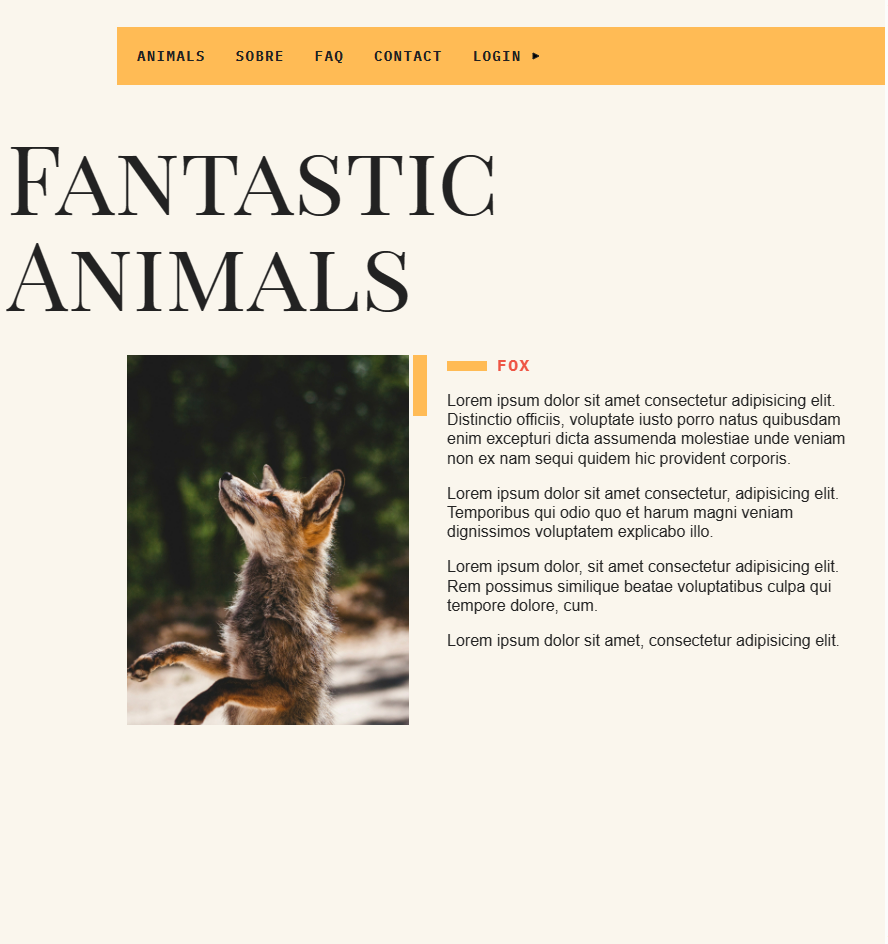

# fantastic-animals

<picture>
 
</picture>

## About

This project was developed during a course of JavaScript, it consists in a web site with some animals information, the animal information comes from a local api, and the bitcoin price from a web api. To consume these apis was used `fetch()`.

## Run
- Download the project
- `npm run dev`
- go live
- and change what you want change

## What I learned

- fetch()
- setTimeout()
- assyncrounos JavaScript
- classes in JavaScript (implemented in the ES6)
- DOM selection
- datasets
- improved my css
- automation, webpack, babel, npm
